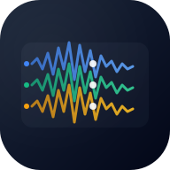

# Audio Compare 🎵

Professional-grade web application for real-time A/B comparison of multiple audio tracks. Built for audio engineers, music producers, and anyone who needs to compare different audio mixes with precision.



## ✨ Features

### Core Functionality
- **Real-time A/B Testing**: Instantly switch between tracks while maintaining playback position
- **Visual Waveform Analysis**: High-resolution waveform visualization powered by WaveSurfer.js v7
- **Synchronized Playback**: Seamless track switching with perfect time synchronization
- **Professional Controls**: Volume, mute/unmute, playback speed (0.5x - 2x)
- **Precision Timeline**: Navigate with frame-accurate timeline and time markers

### Advanced Features
- **Marker System**: Add color-coded markers with labels for important sections
- **Region Selection**: Shift+drag to select and highlight audio regions
- **Zoom & Pan**: Mouse wheel zoom with horizontal scrolling for detailed analysis
- **Buffering Indicator**: Real-time loading progress for each track
- **Keyboard Shortcuts**: Full keyboard control for professional workflow
- **Drag & Drop**: Easy file upload with visual feedback
- **Responsive Design**: Works on desktop and tablet devices

### Audio Format Support
- **Lossless**: WAV, FLAC, AIFF
- **Compressed**: MP3, AAC, OGG
- **File Size**: Up to 512MB per track
- **Track Limit**: Up to 10 simultaneous tracks

## 🚀 Quick Start

### Prerequisites
- Node.js 16.x or higher
- npm 7.x or higher

### Installation

```bash
# Clone the repository
git clone https://github.com/yourusername/audio-compare.git
cd audio-compare

# Install dependencies
npm install

# Start development server
npm start
```

The application will open at [http://localhost:3000](http://localhost:3000)

### Production Build

```bash
# Create optimized production build
npm run build

# Preview production build locally
npx serve -s build
```

## 🎯 Usage Guide

### Basic Workflow
1. **Upload Tracks**: Drag and drop audio files or click to browse
2. **Compare**: Click track names or use number keys (1-9) to switch
3. **Navigate**: Click timeline or use arrow keys for precise control
4. **Analyze**: Zoom with mouse wheel, pan by dragging

### Keyboard Shortcuts
| Key | Action |
|-----|--------|
| `Space` | Play/Pause |
| `←/→` | Skip backward/forward 5 seconds |
| `↑/↓` | Previous/Next track |
| `1-9` | Switch to track 1-9 |
| `0` | Switch to track 10 |
| `M` | Mute/Unmute |
| `+/-` | Zoom in/out |
| `Shift+Click` | Add marker |
| `?` | Show keyboard shortcuts |

### Pro Tips
- Hold Shift while dragging to select regions
- Double-click waveform to add markers
- Use Tab/Shift+Tab for keyboard navigation
- Hover over waveform to see time position

## 🛠️ Technical Architecture

### Technology Stack
- **Frontend Framework**: React 19.1 with TypeScript 4.9
- **Audio Visualization**: WaveSurfer.js v7.10
- **Styling**: Tailwind CSS v3 with custom theme
- **State Management**: React Context API
- **Build Tool**: Create React App
- **Deployment**: AWS Amplify ready

### Performance Optimizations
- React.memo for component optimization
- RequestAnimationFrame for smooth updates
- Lazy loading for audio data
- Efficient waveform rendering

## 📦 Deployment

### AWS Amplify

The project includes `amplify.yml` configuration for automated deployment:

```yaml
version: 1
frontend:
  phases:
    preBuild:
      commands:
        - npm ci --cache .npm --prefer-offline
    build:
      commands:
        - npm run build
  artifacts:
    baseDirectory: build
    files:
      - '**/*'
  cache:
    paths:
      - .npm/**/*
```

### Environment Variables

Optional environment variables for future features:
- `REACT_APP_API_URL` - Backend API endpoint
- `REACT_APP_ANALYTICS_ID` - Analytics tracking ID

## 🔧 Development

### Project Structure
```
src/
├── components/         # React components
├── contexts/          # React Context providers
├── hooks/            # Custom React hooks
├── types/            # TypeScript definitions
├── App.tsx           # Main application component
├── index.tsx         # Application entry point
└── index.css         # Global styles
```

### Available Scripts
```bash
npm start          # Development server
npm run build      # Production build
npm test           # Run tests (setup required)
npm run eject      # Eject from CRA (one-way operation)
```

### Code Style
- TypeScript with strict mode enabled
- Functional components with hooks
- Tailwind CSS for styling
- ESLint for code quality

## 🌐 Browser Compatibility

| Browser | Minimum Version |
|---------|----------------|
| Chrome | 90+ |
| Firefox | 88+ |
| Safari | 14+ |
| Edge | 90+ |

## 🤝 Contributing

Contributions are welcome! Please feel free to submit a Pull Request.

1. Fork the repository
2. Create your feature branch (`git checkout -b feature/AmazingFeature`)
3. Commit your changes (`git commit -m 'Add some AmazingFeature'`)
4. Push to the branch (`git push origin feature/AmazingFeature`)
5. Open a Pull Request

## 📝 License

© 2025 Joseph Team. All rights reserved.

This project is proprietary software. Unauthorized copying, modification, distribution, or use of this software, via any medium, is strictly prohibited without express written permission.

## 🙏 Acknowledgments

- [WaveSurfer.js](https://wavesurfer-js.org/) for audio visualization
- [Tailwind CSS](https://tailwindcss.com/) for styling
- [React](https://reactjs.org/) team for the amazing framework

---

<p align="center">Made with ❤️ for audio professionals and music producers</p>