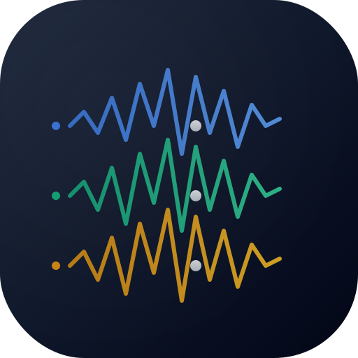

# Audio Compare 🎵

Professional audio comparison tool for A/B testing multiple audio mixes in real-time with synchronized playback and visual waveform representations.



## Features

- **Real-time Audio Comparison**: Compare multiple audio tracks with synchronized playback
- **Visual Waveform Display**: Interactive waveform visualization using WaveSurfer.js
- **A/B Testing**: Seamless switching between different audio versions
- **Timeline Navigation**: Precise timeline with time markers and cursor following
- **Drag & Drop Support**: Easy file upload with drag and drop interface
- **Zoom & Pan**: Mouse wheel zoom and horizontal scrolling for detailed analysis
- **Marker System**: Add custom markers with labels for important sections
- **Modern UI**: Dark theme with glassmorphism effects and smooth animations
- **Professional Grade**: Support for high-quality audio files up to 512MB

## Technology Stack

- **React 19** with TypeScript
- **WaveSurfer.js v7** for audio waveform visualization
- **Tailwind CSS v3** for modern styling
- **Web Audio API** for audio processing
- **HTML5 Audio** for playback control

## Quick Start

```bash
# Install dependencies
npm install

# Start development server (http://localhost:3000)
npm start

# Build for production
npm run build

# Run tests
npm test
```

## Usage

1. **Upload Audio Files**: Drag and drop multiple audio files or click to browse
2. **Compare Tracks**: Click between tracks to switch active playback
3. **Navigate Timeline**: Use the timeline to jump to specific positions
4. **Zoom & Scroll**: Mouse wheel to zoom, drag to scroll horizontally
5. **Add Markers**: Double-click to add markers at specific positions
6. **Adjust Playback**: Control volume, playback speed, and loop settings

## Supported Formats

- WAV, FLAC, AIFF (lossless formats)
- MP3, AAC, OGG (compressed formats)
- Maximum file size: 512MB per track

## Browser Compatibility

- Chrome 90+
- Firefox 88+  
- Safari 14+
- Edge 90+

## Development

Built with Create React App and following modern React patterns:

- Context API for state management
- Custom hooks for audio control
- TypeScript for type safety
- Performance optimizations with React.memo and useMemo

## Architecture

### Core Components
- **AudioContext**: Central state management for audio operations
- **WaveformDisplay**: Container for track display and interactions
- **Track**: Individual track component with waveform and timeline
- **PlaybackControls**: Universal controls for playback management

### Key Features Implementation
- **Synchronized Playback**: HTML5 Audio elements with precise timing
- **Anti-clipping Timeline**: Uses `calc()` positioning to prevent label cutoff
- **Modern Positioning**: All interactive elements use consistent anti-clipping formulas
- **Performance Optimized**: React.memo, useMemo, and useCallback throughout

## License

© 2025 Audio Compare Team. All rights reserved.

---

Made with ❤️ for audio professionals and music producers
